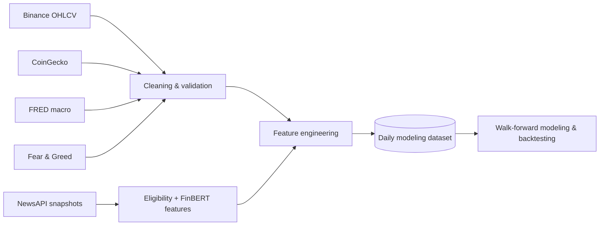

<div align="center">

# Crypto Market Intelligence Pipeline

**Leakage-aware, multi-source data pipeline for cryptocurrency research and next-day market modeling.**

BTC · ETH · SOL — market data, macroeconomics, sentiment, and auditable news features built into a daily modeling dataset.


</div>

## Portfolio Snapshot

This project focuses on the part of market modeling that is easy to get wrong: **data timing, provenance, source coverage, and look-ahead leakage**.

| Capability | Status |
| --- | --- |
| Binance OHLCV pipeline | Implemented |
| CoinGecko market features | Implemented |
| FRED macro features with release-aware timing | Implemented |
| Fear & Greed sentiment | Implemented |
| Combined daily modeling dataset | Implemented |
| NewsAPI immutable snapshots | Implemented |
| FinBERT daily news features | Implemented |
| Predictive models / walk-forward validation | Next |
| Backtesting / dashboard | Next |

The current repository is intentionally a **data and feature-engineering project first**. Model training, walk-forward evaluation, backtesting, and a dashboard are the next stages rather than claims presented as finished work.

## Pipeline at a Glance



### Design priorities

- **Time-aware features:** macro releases use historical availability rather than revised values.
- **Auditable news:** collection snapshots preserve retrieval evidence instead of inventing unavailable history.
- **Source isolation:** BTC, ETH, and SOL remain asset-scoped through joins and target construction.
- **Fail-closed data checks:** duplicate keys, invalid dates, stale macro provenance, and conflicting feature columns are rejected.
- **Reproducible feature outputs:** structured Parquet tables and metadata keep modeling inputs inspectable.

## Data Sources

|Source|Data|
|---|---|
|Binance|Daily OHLCV|
|CoinGecko|Crypto market data|
|FRED|Macroeconomic data|
|Alternative.me|Fear & Greed Index|

## Current Pipeline

Each source currently follows its own workflow:

```text
API
 ↓
Extraction
 ↓
Raw data
 ↓
Cleaning / validation
 ↓
Feature engineering
 ↓
Feature table
 ↓
Combined modeling dataset
```

The combined dataset aligns the four feature tables on UTC date and asset.

## Binance

The Binance pipeline collects daily OHLCV data for:

- BTCUSDT
- ETHUSDT
- SOLUSDT

Outputs:

```text
data/processed/binance_ohlcv_clean.csv
data/processed/features/candle_features.parquet
```

## CoinGecko

CoinGecko is used for additional crypto market data.

Outputs:

```text
data/processed/coingecko_market_chart_clean.csv
data/processed/features/market_features.parquet
```

## FRED

The macro pipeline includes data such as:

- Treasury rates
- Federal Funds rate
- CPI
- Unemployment
- VIX
- Trade-weighted dollar data

One thing I wanted to be careful with here was **look-ahead bias**.

The pipeline uses FRED availability dates so historical rows do not automatically receive information that would only have become available later.

The feature step also includes things such as:

- Rate changes
- Yield-curve features
- VIX returns
- Dollar returns
- Rolling z-scores
- CPI changes
- Unemployment changes

Outputs:

```text
data/processed/fred_macro_clean.csv
data/processed/features/macro_features.parquet
```

## Sentiment

The project also uses the Alternative.me Fear & Greed Index.

The sentiment data is aligned by date with the market data and treated as a market-wide feature.

Outputs:

```text
data/processed/fear_greed_clean.csv
data/processed/features/sentiment_features.parquet
```

## NewsAPI snapshot collection

The collector saves one immutable file per BTC/ETH/SOL scan under
`data/raw/newsapi/<UTC-run-id>-<random-suffix>/<symbol>.json`. It preserves prior
runs and leaves the legacy `data/raw/newsapi_raw.json` untouched. Set `NEWSAPI_KEY`
in your environment or root `.env`; importing the module requires no key.

**This command spends live API quota:**

```bash
python -m src.extractors.newsapi
# Optional: lower the per-asset request allowance or change the publication lookback.
python -m src.extractors.newsapi --lookback-days 3 --max-requests 5
```

Defaults: three publication days, English titles/descriptions, newest first,
100 results per page, 30-second request timeout, and at most ten requests per
asset including retries. Full asset names match directly; ticker matches require
cryptocurrency context. Query text and version are saved. `--output-dir` changes
the snapshot root; `--cutoff-hour` changes the default 23:00 UTC cutoff and must
match the feature builder. No scheduler is installed.

Publication bounds are fixed at run start: `from = run start - lookback days`,
`to = run start`. These are search filters, not evidence of when delayed articles
became available. API restrictions still apply. Do not subtract or add an assumed
provider delay to manufacture historical retrieval times.

Each file contains this structure (illustrative BTC successful empty scan;
actual timestamps and IDs are generated during the run):

```json
{
  "collections": [{
    "run_id": "20261004T230000000000Z-<random-suffix>",
    "symbol": "BTCUSDT",
    "query": "bitcoin OR (BTC AND (crypto OR cryptocurrency OR blockchain OR bitcoin OR ethereum OR solana))",
    "query_version": "direct-assets-v1",
    "search_parameters": {
      "q": "bitcoin OR (BTC AND (crypto OR cryptocurrency OR blockchain OR bitcoin OR ethereum OR solana))",
      "language": "en",
      "searchIn": "title,description",
      "sortBy": "publishedAt",
      "pageSize": 100,
      "from": "2026-10-01T23:00:00+00:00",
      "to": "2026-10-04T23:00:00+00:00"
    },
    "run_started_at": "2026-10-04T23:00:00+00:00",
    "retrieved_at": "2026-10-04T23:00:02+00:00",
    "window_start": "2026-10-04T23:00:00+00:00",
    "window_end": "2026-10-05T23:00:00+00:00",
    "status": "success",
    "stop_reason": "complete",
    "attempts": [{
      "page": 1,
      "attempt": 1,
      "requested_at": "2026-10-04T23:00:00+00:00",
      "responded_at": "2026-10-04T23:00:01+00:00",
      "http_status": 200,
      "total_results": 0,
      "article_count": 0,
      "error": null
    }],
    "response": {"status": "ok", "totalResults": 0, "articles": []}
  }]
}
```

`response` is a constructed combined response, not an untouched individual API
page. Articles retain the received fields and order, once per received occurrence;
repeated article observations are left for the cleaner to deduplicate. Attempt
logs record original page totals/counts; error responses can add a sanitized
`message`. A failed/skipped scan without a valid page has `response.status=error`,
`totalResults=null`, and an empty article list. Its coverage is never successful.

The collector retries connection failures, timeouts and HTTP 5xx twice (2s, 5s)
within the request allowance. Other asset errors end that scan and allow the
next asset to run. HTTP 401/403/429 or shared API-key/quota error codes stop all
requests and save skipped outcomes for the remaining assets. Provider result
limits, inconsistent totals, duplicate URLs, excess counts, early empty pages
and exhausted budgets leave scans incomplete. No automatic interval splitting
or quota-reset waiting occurs. Pagination checks audit the responses received;
NewsAPI does not provide a frozen search index, and these checks cannot establish
internet-wide coverage or detect every index change.

Snapshot saving first durably checkpoints the payload, then records the UTC clock
and writes the complete envelope. The final file is published with an atomic
no-overwrite hard link. The private checkpoint is removed when saving exits, including on a handled
write failure; an abrupt process interruption may leave private files behind.
`retrieved_at` means payload preservation, not the later envelope publication.
Private `.pending-*` files are not inputs to the cleaner. Write errors stop the
run and can discard the current unpublished scan; previously completed asset
files remain. A process interruption can lose
the current unsaved scan, which remains missing coverage. Local filesystem
support for file/directory syncing and hard links is required.

Each outcome belongs to the first cutoff at or after payload preservation. A
23:00 launch normally finishes in the following day's availability window.
Repeated runs in the same window do not erase failed scans: downstream coverage
can remain incomplete even after a later success. The command exits 0 only when
all collector scans succeed, otherwise 1; cleaner validation may still reject
individual articles from successful scans.

Supply **all completed snapshots** to the existing cleaner, including failures.
This local-only example discovers only final asset files, excluding private
checkpoints, and does not call NewsAPI:

```python
from pathlib import Path
from src.transformers.clean_newsapi import create_clean_newsapi

snapshots = sorted(Path("data/raw/newsapi").glob("*/*USDT.json"))
if not snapshots:
    raise FileNotFoundError("No NewsAPI snapshots collected yet")
create_clean_newsapi(snapshots, "data/processed/newsapi")
```

The existing daily feature command then reads that cleaned history. Routine
collector tests make no network calls:

```bash
python -m pytest -q tests/test_newsapi_extractor.py tests/test_newsapi_pipeline.py
```

## NewsAPI cleanup and daily features

The NewsAPI transformation produces standalone daily features for BTCUSDT,
ETHUSDT, and SOLUSDT. Activity and financial tone are separate columns. News
is not yet joined into the combined modeling dataset, and no predictive model
is trained by this step.

Install the optional local sentiment runtime:

```bash
python -m pip install -r requirements-news.txt
```

The cleaner accepts saved raw NewsAPI responses; it makes no API calls. Existing
legacy snapshots can be cleaned for exploration, but their absent retrieval
metadata cannot establish historical predictive eligibility.

For predictive features, provide a JSON object with a `collections` list. Each
entry describes one asset's **entire configured query scan**, with pages already
combined. The included synthetic example is
`tests/fixtures/newsapi/recorded_collections.json`. Required fields are:

| Field | Meaning |
|---|---|
| `run_id`, `symbol`, `query` | Recorded run, BTCUSDT/ETHUSDT/SOLUSDT query, and query text/version |
| `window_start`, `window_end` | Intended availability window, with explicit UTC offsets; normally consecutive 23:00 cutoffs |
| `retrieved_at` | Actual timestamp at which this response was successfully retrieved and preserved, not its scheduled start |
| `status` | `success`, `incomplete`, or `failed` for the whole configured scan |
| `response` | NewsAPI `status`, `totalResults`, and combined `articles` |

These availability windows are not NewsAPI publication-date search bounds.
The producer must supply truthful scan evidence. The transformer validates
required metadata and flags API errors, truncated result counts, and malformed
articles; it cannot independently prove that a producer executed every query.
A successful scan means coverage of the configured query, not all internet news.

Run the included example (synthetic news, no API credentials):

```bash
python -m src.transformers.clean_newsapi \
  --input tests/fixtures/newsapi/recorded_collections.json \
  --output-dir data/processed/newsapi-demo
python -m src.features.news_features \
  --clean-dir data/processed/newsapi-demo \
  --output-dir data/processed/features/newsapi-demo \
  --start-date 2026-09-29 --end-date 2026-09-30
```

The cleaner's default input is `data/raw/newsapi_raw.json`; repeat `--input` to
supply the complete saved snapshot history. Do not process only the newest
snapshot when reconstructing first retrieval. The default cleaned directory is
`data/processed/newsapi`; the default feature directory is
`data/processed/features/newsapi`. Explicit paths override these repo-root defaults.

The first scoring run downloads the public FinBERT checkpoint into the ignored
`models/news-finbert` directory. Subsequent runs can use `--offline-model` to
require cached weights. Inference runs locally on CPU; article text is not sent
to a hosted model. Both tokenizer and model are pinned to revision
`4556d13015211d73dccd3fdd39d39232506f3e43` of `ProsusAI/finbert`.

**Timing:** row t uses articles first retrieved and saved in
`(23:00 UTC on t-1, 23:00 UTC on t]`. A record saved at 23:00:01 on t belongs to
t+1's window. Starting collection at 23:00 ordinarily makes its results too
late for that day's cutoff. `--cutoff-hour` changes the source-specific cutoff;
collection metadata must describe the matching windows. The existing market
prediction target remains close[t+1]/close[t]-1 and is not modified here.

**Cleaning:** normalize aware timestamps to UTC, require a valid publication
time, remove URL fragments and common tracking parameters, and deduplicate
article versions. Keep text revisions and first-observed asset associations.
Direct asset names are matched case-insensitively; bare uppercase tickers require
crypto context in the title or description. These conservative English-text
rules are inspectable heuristics, not a trained relevance classifier. Legitimate
multi-asset articles appear once per relevant asset; query membership alone is
not relevance evidence. Separate publishers remain separate articles.

**Feature outputs:**

- Cleaned `articles.parquet`: article/version/asset identity, source, URL, title,
  description, `published_at`, version `retrieved_at`, and asset association's
  `first_retrieved_at`.
- `collections.parquet` and `rejected.parquet`: scan evidence and rejected raw
  records with reasons.
- `news_features.parquet`: unique date/asset rows with the cutoff, coverage flag,
  article/source counts, `estimated_distinct_story_count`, repeated coverage,
  mean age and time since first retrieval in hours, and separate mean positive,
  negative, neutral scores and scored-text counts for titles and descriptions.
- `article_features.parquet`: selected eligible article versions, scores, and
  inspectable story assignments underlying complete daily rows.
- `metadata.json` and Parquet metadata: cutoff, rule version, grouping parameters,
  pinned scorer and tokenizer revisions, preprocessing, and runtime versions.

Story grouping uses normalized headline similarity of at least 0.92 within
36 publication hours, separately for each asset/day. It estimates events and
may miss paraphrases or merge similar reports. Future articles cannot regroup
past daily rows. Financial tone is text-level sentiment, not asset-specific
sentiment or a probability of rising prices. Missing descriptions remain null;
only scored descriptions enter their averages. Texts are truncated to 512 tokens.

Confirmed zero-article windows have zero counts and null age/sentiment averages.
Incomplete, failed, or missing collection preserves all requested asset/date
rows with null aggregates and a false coverage flag. Unknown retrieval times
never enter predictive rows. Scoring errors abort output publication rather
than masquerading as neutral sentiment. Builds finish computation and temporary
serialization before replacing existing output files.

Routine tests use deterministic sentiment adapters and no network. Run the
separate real-model smoke test after installing the optional runtime:

```bash
RUN_FINBERT_SMOKE=1 python -m pytest -q tests/test_finbert_smoke.py
```

A small synthetic smoke check verifies positive profit-growth text and negative
loss/bankruptcy text. It is a wiring check, not evidence of crypto sentiment
accuracy or predictive value. Model training, baseline availability audits,
walk-forward evaluation, scheduling, news decay, and dataset integration remain
separate work.

## Tech Stack

- Python
- Pandas
- NumPy
- REST APIs
- Parquet
- Pytest

## Setup

Python 3.13 is used for local verification.

```bash
git clone https://github.com/A625A/Crypto-Market-Intelligence-Pipeline.git
cd Crypto-Market-Intelligence-Pipeline

python3.13 -m venv .venv
source .venv/bin/activate

python -m pip install -r requirements.txt
cp .env.example .env
```

Add the required API keys to `.env`:

```dotenv
FRED_API_KEY=your_fred_api_key
COINGECKO_API_KEY=your_coingecko_api_key
COINGECKO_API_PLAN=demo
```

## Running the Pipelines

### Binance

```bash
python -m src.extractors.binance
python -m src.transformers.clean_binance_ohlcv
python -m src.features.candle_features
```

### CoinGecko

```bash
python -m src.extractors.coingecko
python -m src.transformers.clean_coingecko_market_chart
python -m src.features.market_features
```

### FRED

```bash
python -m src.extractors.fred_macro
python -m src.transformers.clean_fred_macro
python -m src.features.macro_features
```

### Fear & Greed

```bash
python -m src.extractors.fear_greed
python -m src.transformers.clean_greed_fear
python -m src.features.sentiment_features
```

### Combined modeling dataset

After generating all four feature tables:

```bash
python -m src.features.modeling_dataset
# Optional strict return threshold: 0.02 means greater than 2%.
python -m src.features.modeling_dataset --return-threshold 0.02
```

Output: `data/processed/modeling_dataset.parquet`. Use `--output PATH` to save
elsewhere. The Python `create_modeling_dataset(...)` function also accepts paths
for all four feature tables, cleaned Binance prices, and the raw FRED JSON.
Default paths are anchored to the repository root.

Each row is keyed by `symbol` and `date` (a timezone-naive timestamp representing
a UTC calendar date). Forecasts are made **after that day's candle closes**.
The clean Binance price grid determines the rows; candle, market, and sentiment
features join by asset and date, while global macro features join by date.
Joins validate cardinality and reject duplicate normalized keys, unknown assets,
conflicting feature names, invalid values, and stale candle closing prices.
Internal gaps in an asset's price history or the daily macro table are errors;
different asset listing dates are allowed. Current-day candles are rejected.

Macro provenance is checked on every file build: the builder replays the existing
cleaner and feature calculations from raw FRED **initial-release** observations
(`output_type=4`), using `realtime_start` as the availability date. The saved macro
table must match that history with its existing one-calendar-day lag. A release
on day `t` first enters features on `t+1`; the join applies no additional lag.
Revised/current-vintage raw data and stale or unlagged macro tables fail before
the output is replaced. `macro_information_date` records the information cutoff
for the joined macro row, not the observation month or each series' release date.
The lower-level `build_modeling_dataset(...)` accepts in-memory frames and assumes
the caller has already verified macro provenance; use the file builder for the
full check.

Missing source coverage and rolling warm-up values stay null. There is no
backfill, interpolation, zero fill, or imputation across assets. Macro values are
carried forward only by the upstream release-aware cleaner; the combined step
does not extrapolate beyond the macro table. `has_candle_features`,
`has_market_features`, `has_macro_features`, and `has_sentiment_features` indicate
whether a source row matched (not whether all its values are populated).
`missing_feature_count` counts null numeric predictors, excluding targets and
audit fields. The existing candle builder omits warm-up and final-day rows, so
those grid rows retain null candle features here.

Targets are rebuilt from cleaned prices using an exact same-asset `date + 1 day`
lookup; legacy future-price columns from the candle table are discarded:

| Column | Definition |
|---|---|
| `target_return_next_1d` | `(close[t+1] - close[t]) / close[t]` |
| `target_direction_next_1d` | `1` when next-day return is positive, otherwise `0` |
| `target_above_threshold_next_1d` | `1` when next-day return is strictly above the threshold (default `0.01`), otherwise `0` |

Returns are fractions, not percentages. Binary targets use nullable integers;
all targets remain null where the next day's close is unavailable. The threshold
and timing convention are stored in the Parquet pandas metadata (`df.attrs`).
The output retains both historical training candidates and final unlabeled rows.
For training, select one target, remove rows missing that label, and **exclude
every `target_*` column from predictors**. Split chronologically before fitting
any imputer or scaler; also keep training labels' next-day dates before the
validation boundary. Retaining missing features avoids silently discarding
history when sources have different coverage.

## Tests

```bash
python -m pip install -r requirements-dev.txt
python -m pytest -q -p no:cacheprovider
```

Combined-dataset tests cover duplicate keys, missing dates and source coverage,
asset isolation, join cardinality, exact targets, null final labels, future-price
perturbations, release-date leakage, raw FRED provenance, and Parquet output.

## Project Structure

```text
.
├── src/
│   ├── extractors/
│   ├── transformers/
│   └── features/
├── tests/
├── .env.example
├── requirements.txt
├── requirements-dev.txt
└── README.md
```

Run the module commands above from the repository root. You can also run an
individual script by its full path from an editor or another directory: default
data paths are anchored to the project folder. Extractors and feature builders
create their output directories under `data/` when needed; generated datasets
are ignored by Git.

FRED requests initial-release observations and release dates within the requested
two-year window. If any required series fails, extraction exits with an error
and leaves the previous raw file unchanged.

Each source is run separately. There is no combined pipeline runner, trained
model, backtester, or dashboard yet.

## Next Steps

The main things I still want to add are:

- Add one orchestration workflow
- Build the first modeling experiments
- Add walk-forward validation
- Add backtesting
- Build a dashboard

There is no live trading functionality at this point.
